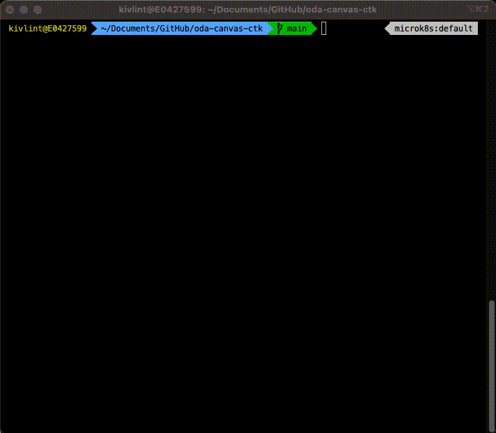

# ODA Canvas - CTK

Following the same approach as the [ODA Component CTK](https://github.com/tmforum-oda/oda-component-ctk), this repository contains the tests that can be executed to check compliance with the Canvas design guidelines. 

Temporarily, these design guidelines can be found here: https://github.com/tomkivlin/oda-ca-docs/blob/patch-1/ODACanvasDesignGuidelines.md

## Executing the CTK tests

To prepare for running the tests:

```
git clone https://github.com/tmforum-oda/oda-canvas-ctk.git
cd oda-canvas-ctk
npm install
```

To run **all** the tests:

```
npm test
```

To run only the **mandatory** tests:

```
CANVAS_CTK_MANDATORY_ONLY=true npm test
```

To control which optional tests are run, set one of the following environment variables to `true`
- CANVAS_CTK_OPTIONAL_KEYCLOAK=true
- CANVAS_CTK_OPTIONAL_ISTIO=true

e.g. the following will include the optional keycloak test, but not Istio:

```
CANVAS_CTK_OPTIONAL_KEYCLOAK=true npm test
```

e.g. the following will include both the keycloak and istio optional tests (today, this is the same as running all tests, but as more optional tests are added it may be useful):

```
CANVAS_CTK_OPTIONAL_ISTIO=true CANVAS_CTK_OPTIONAL_KEYCLOAK=true npm test
```

Example output:



## Kubernetes Conformance

In addition to the tests created within this repository, we can (and should) also run the e2e conformance tests that are provided by the Kubernetes core project.  Basic steps (example for v0.53.2) can be found below, for more information please [read the docs for Sonobuoy](https://sonobuoy.io/docs).

```bash
# Note you can browse to the latest release here: https://github.com/vmware-tanzu/sonobuoy/releases/latest

wget https://github.com/vmware-tanzu/sonobuoy/releases/download/v0.53.2/sonobuoy_0.53.2_darwin_amd64.tar.gz
tar -xvf sonobuoy_0.53.2_darwin_amd64.tar.gz
mv sonobuoy /usr/local/bin

# Make sure you have a valid KUBECONFIG file in place and are using the correct context
sonobuoy run --wait     # Just remove the --wait for async operation
# or, for a quicker result (full tests can take a loooong time - over an hour is not unusual)
sonobuoy run --mode quick   # Again, remove --wait for async
# If you didn't use --wait, you can check the status 
sonobuoy status

# Once finished, get the results and view the summary
results=$(sonobuoy retrieve)
sonobuoy results $results
# Example output:
Plugin: systemd-logs
Status: passed
Total: 1
Passed: 1
Failed: 0
Skipped: 0

Plugin: e2e
Status: failed
Total: 6432
Passed: 342
Failed: 2
Skipped: 6088

Failed tests:
[sig-apps] Daemon set [Serial] should rollback without unnecessary restarts [Conformance]
[sig-network] HostPort validates that there is no conflict between pods with same hostPort but different hostIP and protocol [LinuxOnly] [Conformance]

# Clean up
sonobuoy delete --all --wait
```

## Developing and extending the tests

The CTK tests are written in NodeJS using the [Mocha](https://mochajs.org/) test framework and the [Chai](https://www.chaijs.com/) test assertion library.

At present, there is just one [test.js](tests.js) script with all the tests in - we may choose to split this at a later date.
This script is called from the [package.json](package.json) file using the `mocha` command.
The second script simply adds an environment variable to stop the optional tests being run.

```json
  "scripts": {
    "test": "mocha tests.js"
  },
```

This means to execute the tests, we simply use `npm test`.

A simple example of an assertion test is found below.
For each section of testing there is a `describe` method where you set-up the data required for the test, and then an `it` method for each test.
A test will contain one or more assertions using the Chai library `expect` method (or `should`, depending on the requirement).

```js
describe("Basic Kubernetes checks", function () {
    it("Can connect to the cluster", function (done) {
        k8sApi.listNode().then((res) => {
            expect(res.body).to.not.be.null
            done()
        }).catch(done)
    })
```